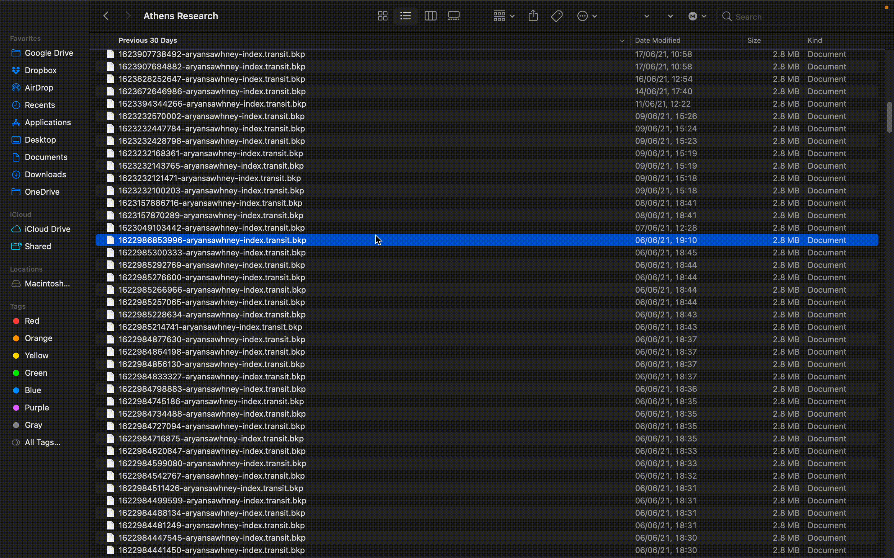

# Backups

At Athens, we fundamentally believe in data ownership and data privacy. It is from this belief that our backup system has been implemented. The primary goal of our backup system is to make it possible to revert your data back to any point in time so that there is _zero_ room for data loss due to corruption and other formatting issues.

### Restoring from Backups

Backups in Athens are stored in a `.bkp` format which is easy to restore from. They are named with a [Unix timestamp](https://en.wikipedia.org/wiki/Unix_time) based on when they were created.

Restoring from a `.bkp` file is a five-step process.

#### Locate your database folder

Backups in Athens are stored in your main DB folder and have a `.bkp` file extension. To locate your database folder, in the Athens app, click the database icon on the toolbar and you will see the current location of your database. In this folder, you will see your backup files.

#### Relocate your `index.transit` file

Before we proceed to the next step, locate your current `index.transit` file and relocate it to another folder.

#### Locate the backup file you want to restore from

Once you are in the folder, find a file with a creation time that corresponds to the state of your database you would like to revert to. For instance, let's say you want to restore my DB to where it was on the night of June 6th. In this case, you find a `.bkp` file with a creation time around that specific time. You can also use a [Unix time converter](https://time.is/Unix_time_converter) to figure out when Athens created a `.bkp` file.

#### Rename the backup file

At this point, rename the selected `.bkp` file to `index.transit`.

#### Open the new file in Athens

Reopen Athens, click the database icon once again and make sure you are on the **Open** pane. Proceed to click the open button and navigate to the newly created \`index.transit\` file. You have now reverted to a backup! All new backups will be created from this file and changes made to your DB will also reflect in the new `index.transit` file.

### Frequency of backups

You can set your desired backup and auto save frequency in the settings page. By default, Athens saves a copy of your database every 15 seconds into your main folder.

### Best practices

As Athens currently doesn't automatically delete your old backups, it becomes important to periodically clear out your folder in order to prevent it from taking too much space on your hard drive. The lower your auto save interval, the more frequently you should undertake this activity.

Additionally, because the backups are locally stored \(for the moment\), it makes sense to periodically backup the folder to a cloud service like Dropbox or Google Drive.

