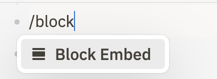
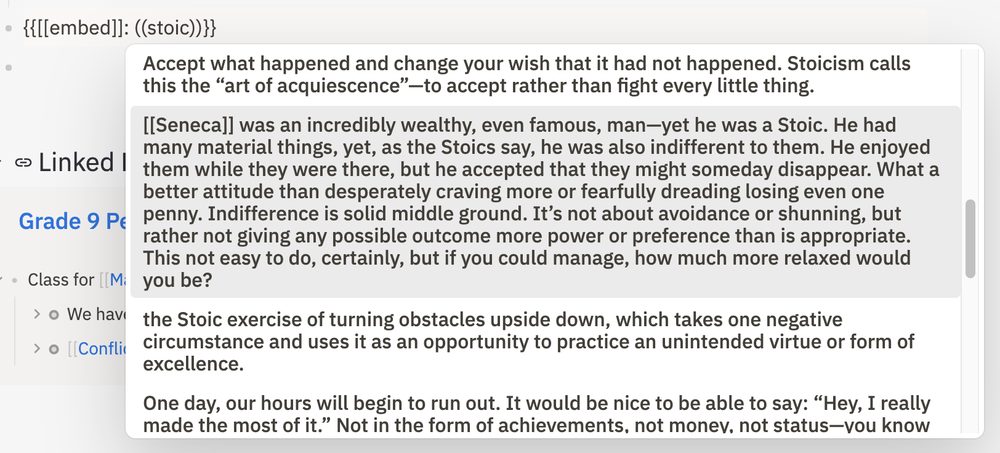
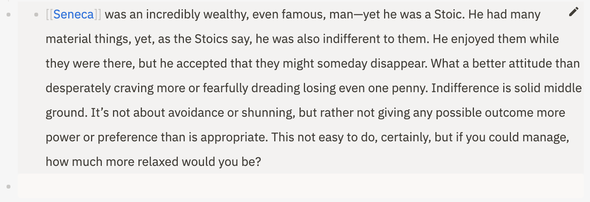

# Block Embed

Similar to [block references](block-references.md), block embeds allow you to embed blocks into your current page. Each block embed can display the contents of a single block, and its children. The major differences from a block reference is that in a block embed, you can zoom into a bullet, view the children of a bullet and make edits to the original block.

Unlike [bidirectional links](bidirectional-links.md), block embeds do not create connections between two pages in the Athens knowledge graph.

## Create a block embed

To create a block embed, hit the ~/~ key to open the slash menu and either filter the results by continuing to type or scroll till you find the block embed.

 

Hit `Enter` or click to create an embed. A dropdown appears to help you search for an existing block you want to reference on your current page.

Move between the items in the dropdown with the up and down arrow keys, then hit `Enter` to select one, or click on the block you're looking for. 

 

When you click out of the block, you will see a block that is now embedded.

  

You can edit, zoom into a bullet, add links and create new bullets as well in the embed.

## Edit the content in a block embed

Click any text in the inside of an embed. Type as you would in a regular block, the changes will be reflected across the original block itself and all the embeds leading to it.

## Edit the block embed itself

Click the pen icon in the top-right corner to change the source of a block embed.

