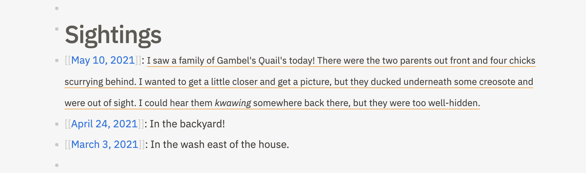
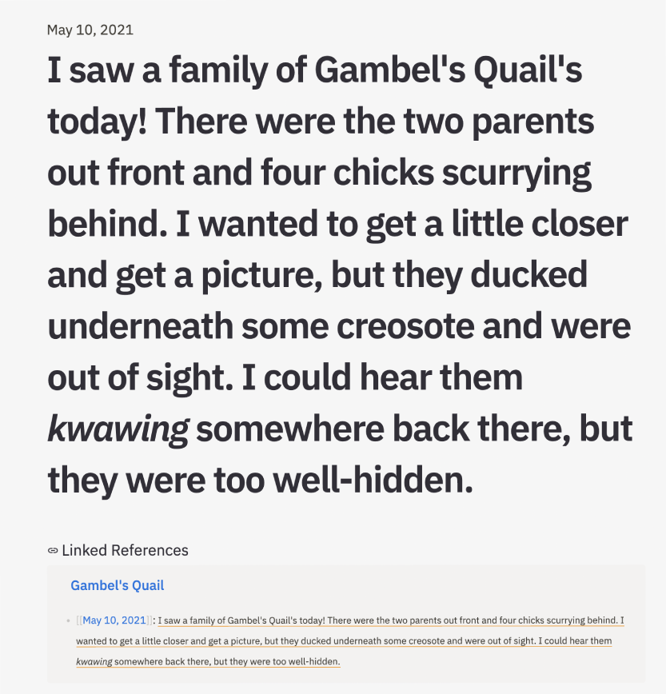
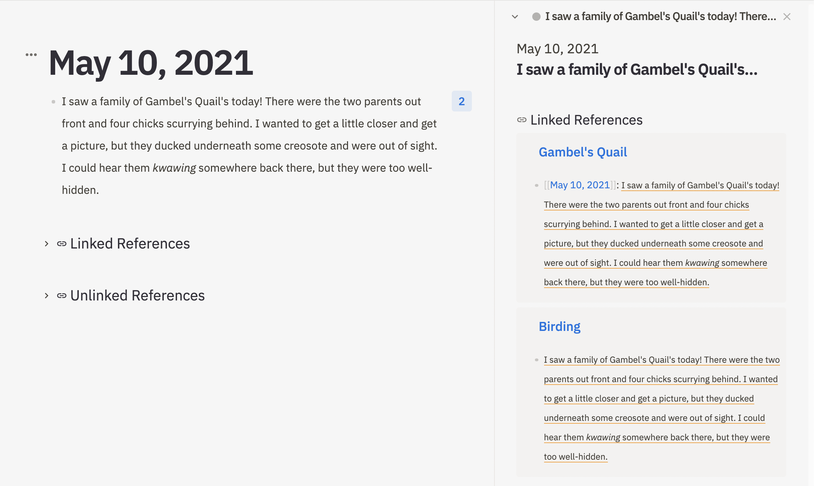

# Block References

Block references embed the content of a single block into your current page. 

Like [bidirectional links](bidirectional-links.md), block references create connections between two pages in your Athens knowledge graph. Once you create a block reference, you can navigate between the two pages using the [Linked References](bidirectional-links.md#linked-references) on either page.

### Create a block reference

To create a block reference, type `((` into the outliner. A dropdown appears to help you search for an existing block you want to reference on your current page.

Move between the items in the dropdown with the up and down arrow keys, then hit `Enter` to select one, or click on the block you're looking for.

Once you move to a different block, the `(())` syntax turns into a block reference, which gets an orange underline to differentiate it from other blocks on your page.

### Navigate to a block's parent page

If you click on a block reference, Athens takes you to the zoomed-in view of the block in question.

Click the title above the block to navigate to that page, or use Linked References to jump to related pages in your knowledge graph.

### View pages that reference a particular block

Every time you reference a block, Athens puts a counter to its right to indicate how many times you referenced it in other pages in your knowledge graph.

Click on this counter to view all these links in the right sidebar.

