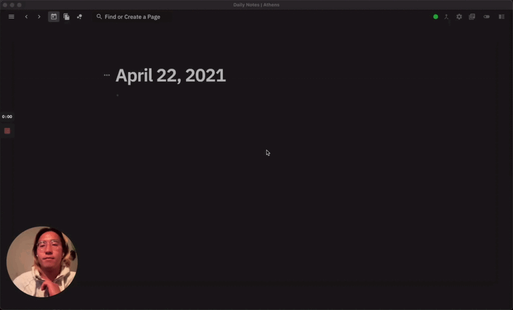

# Athens Guide

## What is Athens?

Athens is an open-source knowledge graph for research and notetaking. It was built as an [outliner](https://en.wikipedia.org/wiki/Outliner) on a [graph database](https://en.wikipedia.org/wiki/Graph_database).

Check out or demo in your local browser [here](https://athensresearch.github.io/athens). Keep in mind, no changes can be saved!

Check out a video demo [here](https://www.loom.com/share/7f9876cb28bd455a9de52673efefa2c8%29). 

Help us write this section [here](https://github.com/athensresearch/athens/issues/1180).

## Installation Setup

[Download Athens](https://github.com/athensresearch/athens/releases) and get started with [our guide](./).

Help us write this section [here](https://github.com/athensresearch/athens/issues/1181). 

## Hosting Your Own Data

Help us write this section here.

## Getting Started

If you're new to Athens, read our [basics guide](the-basics.md). In just a few minutes, you will learn how to navigate your growing knowledge graph, manipulate and format blocks, and create bidirectional links.

If you're coming to Athens from Roam Research, check out the [import](feature-list/import.md) doc for details on how to bring your Roam content over to Athens.

## Cheatsheet

Download a PDF version of the Athens cheat sheet [here](https://github.com/ddauber/athens-cheat-sheet/blob/main/athens_cheatsheet.pdf). 

Help us write this section [here](https://github.com/athensresearch/athens/issues/1184).

## Community Help

Our community is active on [discord](https://discord.gg/as9h8yHNfD) and [github](https://github.com/athensresearch/athens/discussions).

Help us write this section [here](https://github.com/athensresearch/athens/issues/1183). 

## Get Involved

 -Share ideas, ask questions, and give feedback in Discord

Insert some examples here.

-Report bugs on Github

-Request and test new features

-Help troubleshoot

-Contribute code

-Help translate

-Help document

-Create templates and how-to guides

-Mentor

Help us write this section [here](https://github.com/athensresearch/athens/issues/1185).

