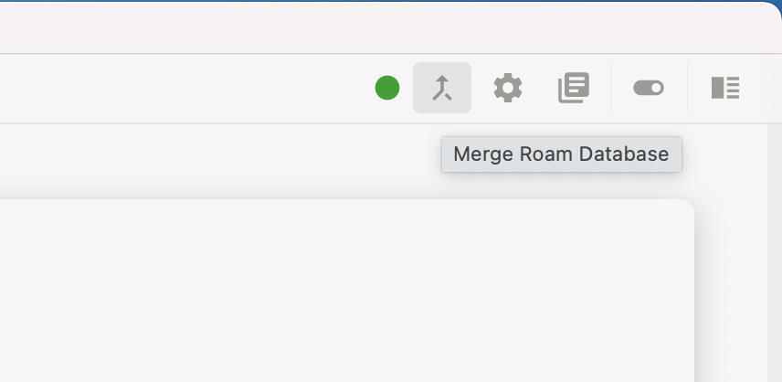
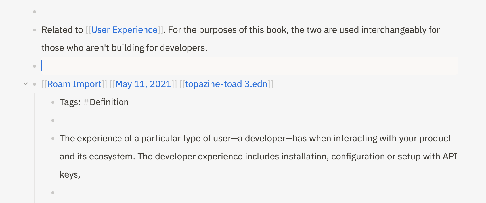

# Import

To download a `.edn` file from Roam Research, visit your Roam graph and click on the three doc symbol **⋯** in the top bar, then **Export All**. Choose **EDN** from the Export Format dropdown, then click **Export All**.

You'll download a `.zip` file, which you need to open/extract the `.edn` file out of.

In Athens, click on the merge icon in the top bar.

Click **Choose File**, then search for the `.edn` file on your system.

Athens tells you how many of the pages are [shared](import.md#shared-pages) between your existing graph and the content you're importing from Roam.

Click **Merge** to finish.

### Shared pages

When importing pages that have the same title as an existing page in your Athens graph, the default merge strategy is to place the imported content at the bottom of the existing page.

Athens creates a block with the text: `[[Roam Import]] [[DATE]] [[FILE.edn]]`, then nests all the imported content in that block.

This also creates pages for **Roam Import**, the date of the merge \(if the [daily note](daily-notes.md) doesn't already exist\), and the name of the imported file. Each of these can be useful to explore how your Roam graph was imported into Athens.

